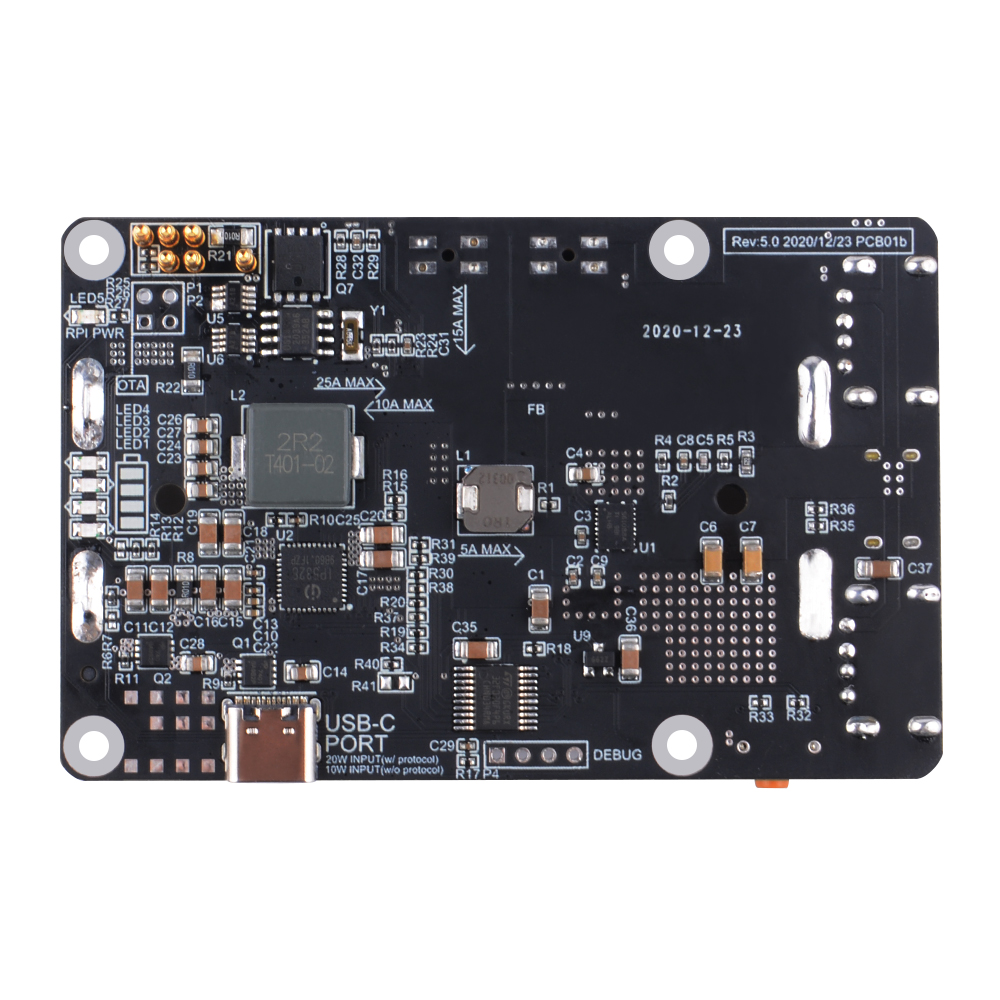

# UPS Plus Daemon
Customized daemon script for UPS Plus from GeeekPi.

## Features
* On power failure
  * Shutdown OS after x minutes
  * Shutdown OS on low battery voltage
  * Power off UPS after shutdown OS
* Auto start on power resume
* UPS full status log
  * Log file is rolling on day basis
  * Old log files exceed upper limit are deleted
* Data check & retry on read/write UPS status register

## Prerequisite
The script should be work on Raspbian 32bit & 64bit. I test it only on OctoPi which is based on Raspbian 32bit.

Before installtion, be sure you have following packages installed:
* Git
* Python3

Install these packages by (if you don't have them installed):
```bash
apt install git python3
```

## Installtion
The UPS Plus daemon script can be installed by:
```bash
cd ~
git clone https://github.com/isjfk/upsplus.git
cd upsplus/daemon
./upsPlusDaemon_install.sh
```
* The daemon script will be copied into: ~/bin/upsPlusDaemon.py
* A cron job will be added into crontab. You can check the cron job by:
  ```bash
  $ crontab -l
  * * * * * /usr/bin/python3 /home/pi/bin/upsPlusDaemon.py
  ```
* By default the script will be executed every minutes. Which means even you set powerFailureToShutdownTime to 0, the OS may still wait for 1 minutes before shutdown. However there's no way to reduce the interval since 1 minutes is the minimal interval can be set with crontab.
* Log will be saved into: ~/log/upsPlusDaemon.log
* A status file will be saved into: /tmp/upsPlusStatus.json
  * The status file is required to save the power failure time, calculate shutdown timeout.

## Configuration
Change configuration by edit the daemon script:
```bash
vim ~/bin/upsPlusDaemon.py
```
The configuration section is in start of the script file:
```python
UPS_CONFIG = {
    # Shutdown the OS after battery voltage lower then this setting. Unit: V
    'shutdownVoltage': 3.90,
    # The timeout before shutdown the OS after power failure. Unit: second
    # E.g.:
    # Set to 10 * 60 will shutdown the OS after power failure for 10 minutes
    # Set to 0 will shutdown the OS immediately after power failure
    # Set to -1 will disable the timeout
    'powerFailureToShutdownTime': 10 * 60,
    # Command to execute to shutdown the OS
    'shutdownCmd': 'sudo shutdown -h now',
    # Log UPS status on read/write status file. Set to True if you want UPS status history in log
    'logStatus.read': False,
    'logStatus.write': True,
    # Path to save the log
    'logFilePath': os.getenv('HOME') + '/log/upsPlusDaemon.log',
    # Path to save UPS status. This file is required to calculate shutdown timeout
    'statusFilePath': '/tmp/upsPlusStatus.json',
}

UPS_DEVICE = {
    # Define I2C bus
    'bus': 1,
    # Define device i2c slave address
    'address': 0x17,
    # Set the sample period. Unit: min default: 2 min
    'samplePeriod': 2,
    # Set auto power on when charger connected. 1: enabled, 0: disabled
    'autoPowerOn': 1,
    # Set the threshold of UPS force power-off to prevent damage caused by battery over-discharge. Unit: V
    'batteryProtectionVoltage': 3.50,
    # Shutdown countdown timer. UPS will power off on timeout. Be sure OS will finish shutdown before timeout. Unit: second
    'shutdownCountdown': 30,
}
```

## About UPS Plus
  
